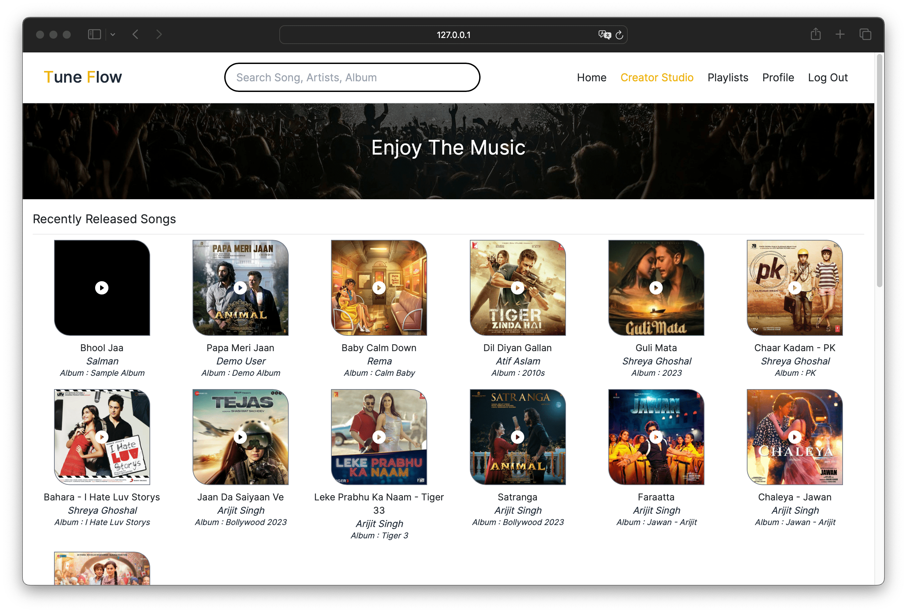
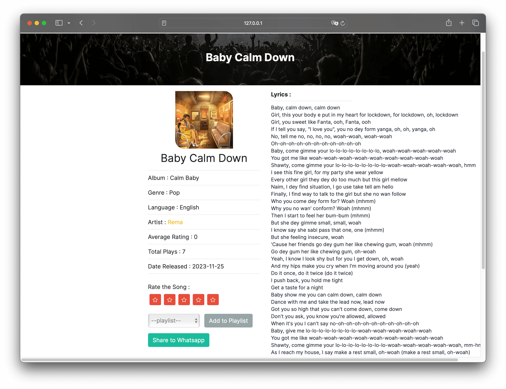
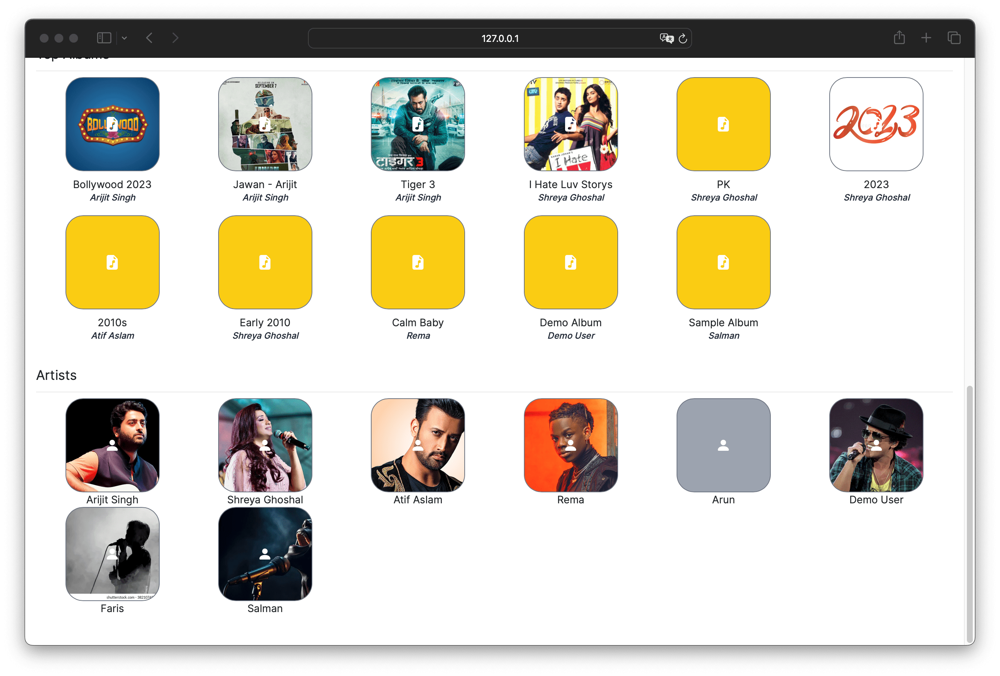
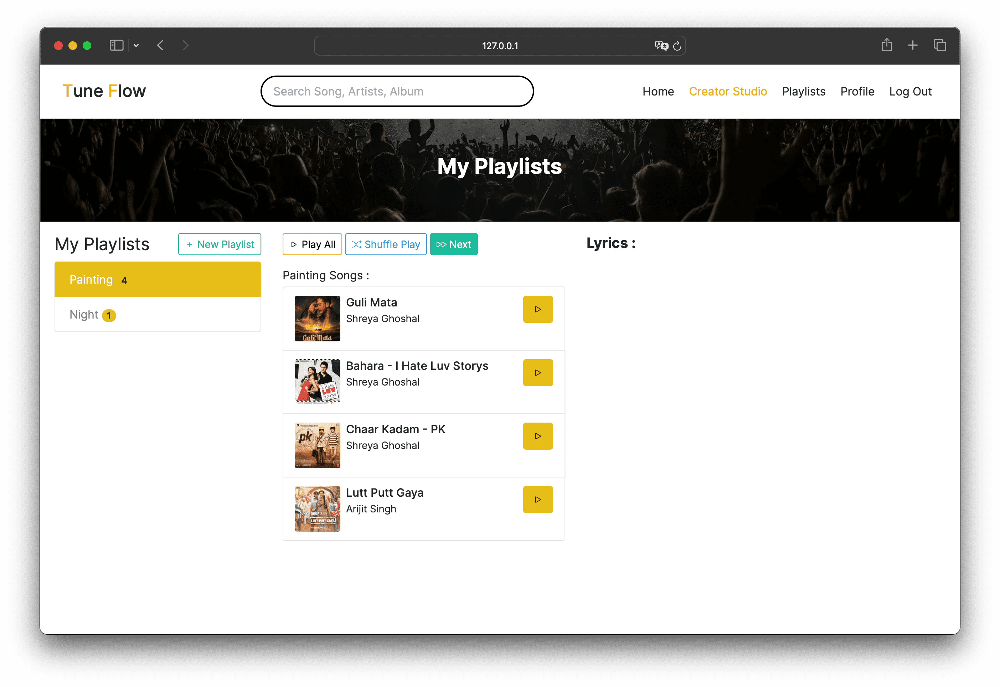
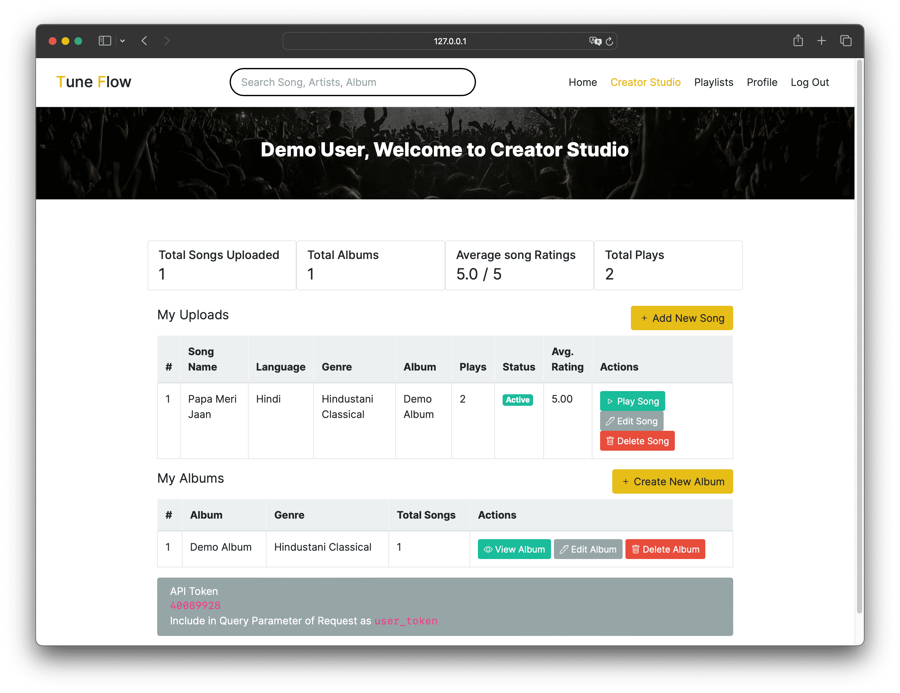

## Music Streaming App
### Modern Application Development Project
Author : Salmanul Faris

## Screenshots

   
   
   
   
   

>**About Application** 
> 
>This is App is developed in flask, using Bootstrap 5 as CSS framework, 
>and SQLite as Database.

#### Steps to use application
1. Create Virtual Environment 
  
   ``python -m virtualenv myenv``

2. Activate Virtual Environment
  
   ``source /myenv/bin/activate``

3. Install all required packages for app

    ``pip install -r requirements.txt``

4. Change entry file of flask

      ``export FLASK_APP=app``

5. Start Server
  
    ``flask run --debug``

6. Migrate Data
   
   Go to  [base_url/migrate]() to migrate db and seed basic data like language and genres

> #### API Documentation 
> https://documenter.getpostman.com/view/9484186/2s9YeD9tKS
